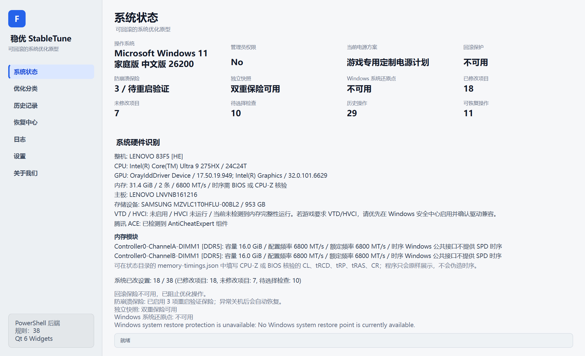
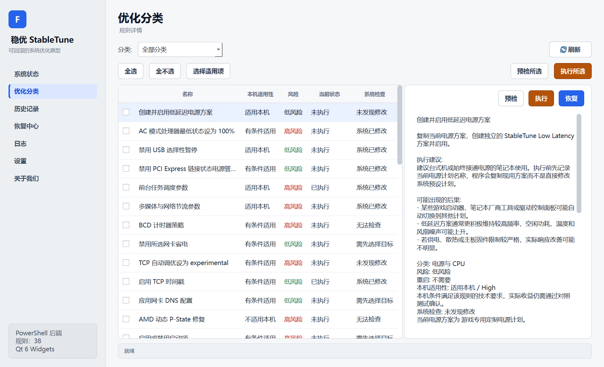
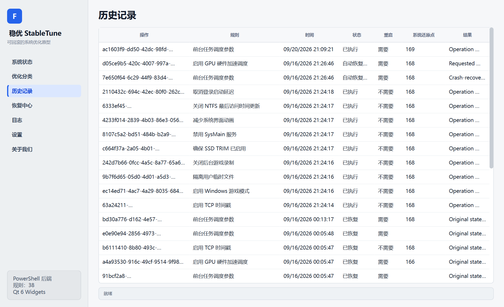
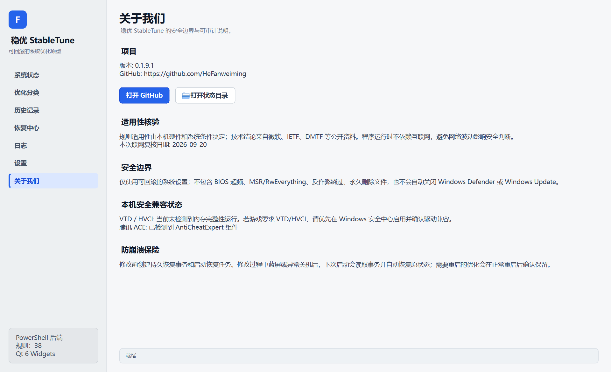

# 稳优 StableTune

稳优 StableTune 是一个面向 Windows 10/11 x64 的可回滚系统优化工具。它通过
明确、可审计的规则检查本机硬件和系统条件，在执行前创建回滚保险，并在修改
后保留历史、验证状态和恢复入口。

[下载最新版本](https://github.com/HeFanweiming/StableTune/releases/latest)

当前版本：`0.1.9.2`

当前说明对应版本：`0.1.9.2`

> StableTune 只执行用户明确选择的优化项目。程序不会自动批量修改系统，不会
> 提供 BIOS 超频、MSR/RwEverything、反作弊绕过或永久删除文件等功能。



## 主要特性

- **38 项固定规则**：覆盖电源与 CPU、延迟与调度、网络、GPU、启动服务、存储、
  硬件绑定、输入响应和系统界面等类别。
- **本机适用性核验**：结合操作系统版本、CPU、GPU、内存、存储、驱动和硬件
  条件判断规则是否适用于当前设备。
- **执行前快照**：每项修改都会保存修改前的真实值，不依赖 Windows 默认模板
  推测原状态。
- **双重回滚保险**：默认要求独立快照和 Windows 系统还原点同时可用。
- **逐项恢复与恢复全部**：历史记录保留操作 ID、规则、状态、结果和还原点
  信息，可按照原快照恢复。
- **防崩溃保险**：需要重启的优化会建立持久恢复事务；异常关机或蓝屏后，
  下次运行可恢复被中断的操作。
- **Qt 6 Widgets 界面**：提供系统状态、优化分类、历史记录、恢复中心、日志、
  设置和关于页面。
- **中文本地化**：界面、规则说明、风险提示和执行建议均为中文。
- **运行时不依赖互联网**：规则判断在本机完成，避免网络波动影响安全决策。

## 下载与安装

### 系统要求

- Windows 10 或 Windows 11，x64
- PowerShell 7.4 或更高版本
- 修改系统设置时需要管理员权限
- 建议预留至少 150 MB 可用空间

### 便携版运行

1. 打开 [Releases](https://github.com/HeFanweiming/StableTune/releases/latest)。
2. 下载 `StableTune-v0.1.9.2-win-x64.zip`。
3. 解压到普通目录，例如 `D:\Tools\StableTune`。
4. 双击 `Start-StableTune.cmd`，或直接运行 `bin\StableTune.exe`。
5. 程序以普通权限启动；执行需要管理员权限的规则时，按提示完成 UAC 确认。

发布页同时提供 `.sha256` 文件。使用 PowerShell 校验下载包：

仓库内同时保留当前源码发布包：

```text
dist/StableTune-prototype-v0.1.9.2-20260920.zip
```

```powershell
Get-FileHash .\StableTune-v0.1.9.2-win-x64.zip -Algorithm SHA256
```

计算出的值应与 `.sha256` 文件中的值完全一致。

### 缺少 PowerShell 7

StableTune 的规则引擎使用 PowerShell 7 后端。Windows PowerShell 5.1 不满足
运行要求。可通过以下命令安装：

```powershell
winget install --id Microsoft.PowerShell --source winget
```

安装后重新打开 `Start-StableTune.cmd`。

## 快速开始

### 1. 查看系统状态

“系统状态”页面显示操作系统、管理员状态、活动电源方案、硬件识别、内存模块、
VTD/HVCI、内存完整性、腾讯 ACE 检测、回滚保险和历史统计。

### 2. 检查本机适用性

进入“优化分类”，每项规则会显示：

- 本机适用性
- 风险等级
- 当前执行状态
- 系统检查结果
- 技术依据和适用条件

高风险或需要目标设备的规则不会在条件不满足时执行。

### 3. 预检

选择规则后点击“预检”。预检只读取系统状态，不修改任何设置。程序会显示
计划执行的命令、涉及的目标和可能影响。



### 4. 执行和恢复

- “执行”：按预检结果应用规则。
- “恢复”：使用该操作的原始快照恢复。
- “历史记录”：查看成功、失败、自动恢复和待重启验证的操作。
- “恢复中心”：批量恢复尚未恢复的操作。

涉及重启的规则会在正常重启后确认保留；如果发生异常关机，程序会保留恢复
事务并在下次启动时处理。

## 回滚与数据安全

### 回滚保险

默认策略为双重回滚：

1. 独立快照存储可用。
2. Windows 系统还原点可用。

如果关闭 Windows 系统还原点要求，程序仍会强制使用独立快照，并在每次执行前
显示风险提示。独立快照不可用时，优化会被阻止。

### 状态目录

为兼容早期版本的历史记录、快照和回滚数据，状态目录保留为：

```text
%LOCALAPPDATA%\FelixOptimizer
```

这是内部兼容路径，不代表程序仍使用旧品牌。可以通过环境变量覆盖：

```powershell
$env:FELIX_OPTIMIZER_HOME = 'D:\StableTuneState'
```

请勿在程序执行过程中删除状态目录、快照或历史文件。



## 安全边界

StableTune 不包含以下功能：

- BIOS、UEFI 或硬件超频
- MSR 直接写入或 RwEverything 类底层访问
- 反作弊绕过、注入、伪装或篡改
- 永久删除用户文件
- 自动关闭 Windows Defender、VBS、HVCI 或 Windows Update
- 隐藏式遥测、远程控制或后台自动优化

程序不会把所有规则都视为适用。无法确认硬件、系统版本、驱动能力或目标设备
时，规则应保持“无法检查”或“不适用”，而不是继续执行。

## 规则类别

| 类别 | 示例 |
|---|---|
| 电源与 CPU | 低延迟电源方案、AC 处理器最低状态、异类调度基线 |
| 延迟与调度 | 前台任务调度、多媒体节流、计时器策略 |
| 网络 | TCP 参数、时间戳、DNS、网卡省电 |
| GPU 与图形 | 硬件加速调度、游戏模式相关设置 |
| 启动与服务 | 启动项、服务和登录延迟管理 |
| 存储与维护 | TRIM、NTFS、临时文件隔离 |
| 硬件绑定 | CPU 亲和性、网卡和中断设备选择 |
| 输入与响应 | USB 选择性暂停、鼠标输入参数 |
| 系统界面 | 动画和系统响应相关设置 |

规则目录位于 `src/StableTune/rules/catalog.json`。每条规则都有风险级别、
适用性条件、执行建议、恢复方式和官方技术依据。

## 界面预览

### 关于页面



## 从源码构建

### 开发依赖

- Windows 10/11 x64
- Visual Studio 2022/2026，安装“使用 C++ 的桌面开发”
- CMake 3.24 或更高版本
- Qt 6.8+ MSVC x64，包含 `Core`、`Concurrent`、`Gui`、`Widgets` 和 `Test`
- PowerShell 7.4 或更高版本

### 配置和编译

```powershell
$qtRoot = 'C:\Qt\6.8.3\msvc2022_64'

cmake -S cpp -B tmp\qt-build -G "Visual Studio 18 2026" -A x64 `
  -DCMAKE_PREFIX_PATH=$qtRoot `
  -DBUILD_TESTING=ON

cmake --build tmp\qt-build --config Release --parallel
```

### 运行 C++ 核心测试

```powershell
ctest --test-dir tmp\qt-build -C Release --output-on-failure
```

### 运行 PowerShell 测试

```powershell
pwsh -NoProfile -File .\tests\Run-Tests.ps1
pwsh -NoProfile -File .\tests\Test-Smoke.ps1
```

### 生成安装目录

```powershell
$prefix = (Resolve-Path .\tmp).Path + '\StableTune'
cmake --install tmp\qt-build --config Release --prefix $prefix
```

安装流程会复制 Qt 运行库、平台插件、PowerShell 模块和规则目录。

生成与 GitHub Release 一致的便携包：

```powershell
pwsh -NoLogo -NoProfile -File .\Build-PortableRelease.ps1 `
  -Version 0.1.9.2 `
  -InstallRoot .\tmp\StableTune `
  -OutputDirectory .\tmp\portable-release
```

打包脚本会固定写入 CRLF/ASCII 启动器，并拒绝覆盖已有输出。

## 命令行

除了图形界面，也可以执行只读检查或指定操作：

```powershell
pwsh -NoProfile -File .\StableTune.ps1 -Command List
pwsh -NoProfile -File .\StableTune.ps1 -Command Audit
pwsh -NoProfile -File .\StableTune.ps1 -Command Hardware
pwsh -NoProfile -File .\StableTune.ps1 -Command ChangeAudit
pwsh -NoProfile -File .\StableTune.ps1 -Command DryRun -RuleId power-plan
pwsh -NoProfile -File .\StableTune.ps1 -Command Apply -RuleId power-plan -AcceptRisk
pwsh -NoProfile -File .\StableTune.ps1 -Command Restore -HistoryId <操作ID>
pwsh -NoProfile -File .\StableTune.ps1 -Command RestoreAll
```

执行前请先运行 `DryRun`，并逐项阅读规则说明。

## 仓库结构

```text
StableTune.ps1                 PowerShell/WPF 入口
Start-StableTune.cmd           管理员启动器
src/StableTune/                PowerShell 规则引擎、WPF UI、资源和规则
cpp/core/                      原生规则、快照和 Windows 处理器
cpp/bridge/                    PowerShell JSON 桥接
cpp/qt/                        Qt 6 Widgets 正式界面
cpp/backend/                   PowerShell 后端托管入口
tests/                         Pester、冒烟和规则回归测试
tools/                         仓库校验工具
dist/                          当前源码发布包、哈希和 manifest
docs/                          使用说明、发布说明和 GitHub README 源文件
```

## 常见问题

### 为什么状态目录仍叫 FelixOptimizer？

早期版本已经在该目录保存历史、快照和回滚事务。更名后保留原路径可以避免
升级时丢失恢复数据。对外程序名、窗口、启动器、模块目录和发布包均已改为
StableTune。

### 为什么运行程序需要 PowerShell 7？

PowerShell 7 负责规则审计、快照、回滚、日志和系统处理器。Qt 界面通过本机
JSON 桥接调用同一套后端，不直接执行未经检查的脚本。

### 为什么 Windows 会显示未知发布者？

当前发布包未进行商业代码签名。Windows SmartScreen 可能提示未知发布者。
请从本仓库 Releases 页面下载，并使用发布页 SHA-256 校验文件完整性。

### 为什么某些规则显示“不适用”？

规则会检查 CPU 品牌、GPU、驱动版本、存储类型、网络设备、操作系统构建和
其他条件。不能确认条件时，程序会阻止或跳过该项，而不会假设其可用。

### 如何完全恢复？

打开“恢复中心”，选择“恢复全部”。恢复过程会按照历史顺序逆序处理尚未恢复
的操作。涉及重启的项目会在恢复后提示重启。

## 免责声明

系统优化仍然存在硬件差异、驱动兼容性和厂商策略变化。首次使用建议在 Windows
10/11 虚拟机或可回滚测试环境中验证。执行高级规则前，请保存工作、确认电源
稳定并保留 Windows 系统还原点。

本项目按现状提供，不承诺任何特定性能收益。使用者应自行判断规则是否适合
自己的设备和使用场景。
